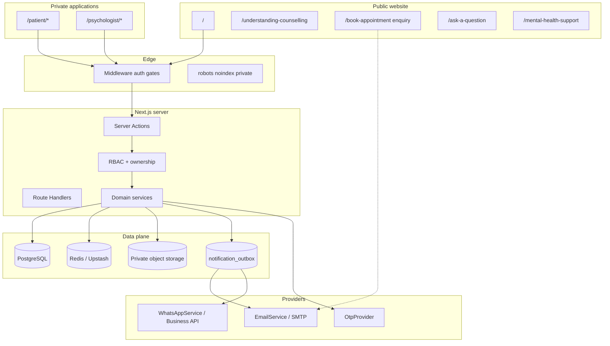
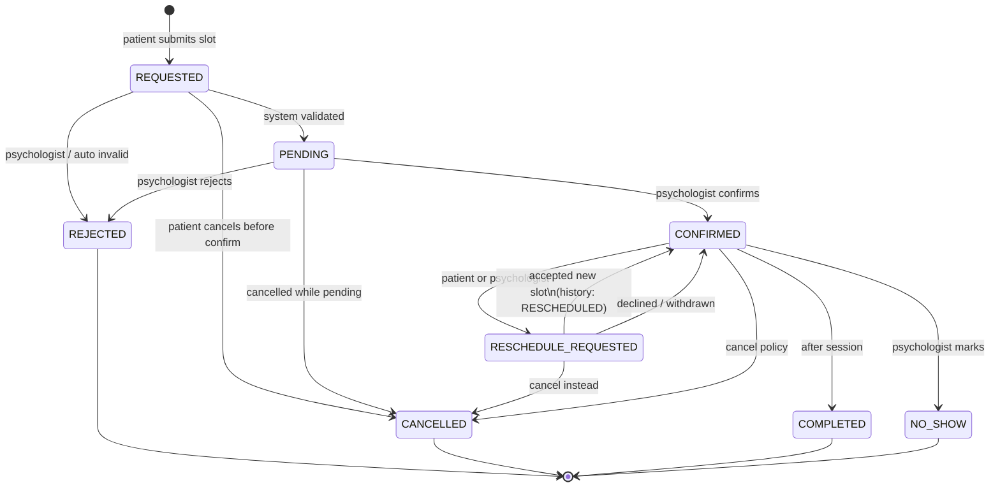
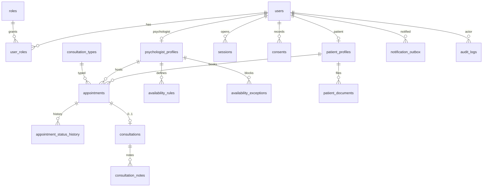

# Patient & Practice Management System — Architecture Blueprint (Phase 0)

**Status:** DESIGN ONLY — HARD STOP before implementation  
**Date:** 14 August 2026  
**Product scope lock:** see `docs/PATIENT_PRACTICE_DECISIONS.md` (Phase 0.5). That register **outranks** this blueprint.

**Option B** (patient accounts + appointments + notifications) is **APPROVED** as the first production direction.  
**Option C** (clinical notes, consultation charts, clinical documents) is **DEFERRED — NOT APPROVED FOR IMPLEMENTATION**.  
**`SUPER_ADMIN`** exists architecturally for practice configuration and is **not** automatic clinical access. Dashboard implementation is **DEFERRED**.

Do not implement deferred entities in this file merely because they appear in the ERD.  
**Repository:** https://github.com/ravishori/dr-vandana-website  
**Code baseline inspected:** `cursor/existing-feature-audit-d73b` (PR #10, commit `2081716`)  
**This document does not implement software.** No migrations, portals, OTP, WhatsApp Business API, or booking engine were added.

> **Not legal advice.** Privacy, DPDP, professional confidentiality, and retention statements below are architecture considerations that require independent legal and professional review.

---

## 1. Executive summary

The live product is a public psychology **marketing and education website** with:

- Appointment **enquiry** (email to the practice; not a booking calendar)
- Ask Dr. Vandana AI (educational)
- Public question form + single-admin psychologist portal
- Crisis helpline directory

It has **no production patient-management system**. Draft PR #9 is a prototype (mocked OTP/WhatsApp, JSON snapshot store). **Do not merge or reuse it as production architecture.**

This blueprint specifies a **modular monolith** inside the existing Next.js App Router app:

- Public site unchanged except later privacy/legal copy and a future “sign in / book as a patient” entry point
- New private apps at `/patient/*` and expanded `/psychologist/*`
- New **PostgreSQL** bounded context for identity, appointments, consultations, notes, documents, notifications, and audit
- Existing enquiry, question portal, and crisis directory **kept** until the authenticated booking path is proven

**Policy gate (must be approved before production):** the current BRD extract and privacy policy forbid EHR/clinical notes on the website database. Building private clinical notes and documents **contradicts that published boundary**. Implementation of clinical records must not start until privacy/terms/BRD are rewritten and legally reviewed.

---

## 2. Current architecture

Verified against code on the PR #10 checkpoint (not assumed from the audit alone).

### Frontend

| Item | Actual |
|---|---|
| Framework | Next.js **16.3.0** App Router |
| UI | React **19.2.8** + TypeScript |
| Styling | Tailwind CSS 4, CSS tokens, six themes (`calm-sage` default) |
| Strategy | Mostly React Server Components; client islands for forms, FAQ search, nav drawer, theme, Ask AI |
| Public routes | `/`, `/about`, `/areas-of-support`, `/child-adolescent-psychology`, `/stress-anxiety-wellness`, `/understanding-counselling`, `/contact`, `/book-appointment`, legal pages, Ask AI, ask-a-question, case studies, `/mental-health-support` |
| Staff routes | `/psychologist/login`, dashboard, `/psychologist/questions/*`, `/psychologist/crisis/*` |

### Backend

| Item | Actual |
|---|---|
| Style | Server Actions + 2 Route Handlers (`POST /api/ai/ask`, `POST /api/internal/errors`) |
| Validation | Zod |
| Auth | Single env psychologist (`PSYCHOLOGIST_LOGIN_EMAIL` + scrypt hash). HMAC cookie `drvandana_portal_session`, 8h TTL, `jti` unused (no revocation) |
| Middleware | `/psychologist/:path*` except login |
| Email | Nodemailer SMTP (`SMTP_*`, `APPOINTMENT_TO_EMAIL`) |
| WhatsApp | `wa.me` + Bitly only — **not** Business API |
| Rate limit | Memory in dev; Upstash required in production (fail-closed for appointment/question stores) |
| ORM | **None** |

### Storage today

| Domain | Store | Production-safe? |
|---|---|---|
| Appointment enquiries | Not persisted (SMTP only) | N/A — not a booking system |
| Questions | SQLite **tables** / Upstash JSON / memory | Durable only with Upstash or a Node disk |
| Crisis directory | SQLite/Upstash/memory JSON blobs | Public page can fall back to memory |
| AI conversation | In-process `Map` | Ephemeral |
| Patients / appointments / notes / documents | **None** | — |

There is **no production relational database** for practice operations.

### Auth today

- Patient registration/login/OTP/MFA: **absent**
- Psychologist: one shared env credential, no MFA, no session table
- Password hashing (`scrypt` + salt + `timingSafeEqual`) **is reusable**

### Notifications today

- Email: enquiry, question notify/reply, error alerts — **CONFIGURATION REQUIRED**
- WhatsApp: visitor-initiated links only
- SMS: none

### Search indexing today

- `robots.ts` disallows `/api/` and `/psychologist`
- Sitemap omits psychologist routes
- Psychologist layout is `noindex`
- **`/patient/*` does not exist yet** and must be added to robots/sitemap exclusion when built

### Original product boundary (conflict)

`docs/BRD-extract.txt` §3.1: website is lead intake only; EHR/clinical notes are an “isolated off-site system”; “No EHR/EMR Integration in Website Database.”

`src/data/legal.ts`: the public website does not create a patient database, portal, or clinical record from submissions.

**This PMS, if it includes clinical notes and documents, is a product-boundary change, not a feature add.**

### What PR #9 got wrong (do not reuse)

| Prototype choice | Why it is not production |
|---|---|
| Entire practice state as one SQLite JSON blob | No relational integrity, no slot exclusion, unsafe concurrent writers |
| `MockOtpProvider` / `MockWhatsAppProvider` as default | Production would silently pretend to notify |
| Local `data/practice-documents` | Ephemeral/unshared on Vercel; not a document vault |
| Sequential `PAT-000001` | Enumerable public IDs |
| Second HMAC cookie, no session rows | Still no revocation/device inventory |
| No PostgreSQL exclusion constraints | Double-booking not actually prevented |

Useful **ideas** from the prototype (patterns only): provider interfaces, hashed OTP, TOTP helper, consent flags, privacy-safe notification copy, status history list. Re-implement those against a real schema — do not copy the store.

---

## 3. Target architecture

A **single Next.js application**, three surfaces, one new data plane:

1. **Public website** — existing marketing/education + enquiry fallback  
2. **Patient portal** — `/patient/*`  
3. **Psychologist workspace** — existing question/crisis portal **plus** practice modules  

Practice data lives in **PostgreSQL**. Files live in **private object storage** with short-lived signed URLs. Notifications go through an **outbox**, never directly from appointment transactions to a vendor SDK.

```text
Visitor / Patient / Psychologist
              |
     Next.js App Router (Vercel or Node)
              |
     +--------+--------+------------------+
     |        |        |                  |
  Public   Patient  Psychologist     Existing
  pages    portal   workspace        enquiry / Q&A / crisis
     |        |        |
     +--------+--------+
              |
     Practice API (Server Actions + a few Route Handlers)
              |
     Authz (session + RBAC + ownership)
              |
     +--------+--------+------------------+
     |        |        |                  |
 PostgreSQL  Redis   Object storage   Notification outbox
 (system of   (rate    (private         ├── EmailService (SMTP)
  record)     limit /   documents,          └── existing Nodemailer
              queue)    signed URLs)    └── WhatsAppService (Business API)
```

**Coexistence rule:** enquiry form, question portal HMAC session, and crisis CMS stay until explicitly migrated. PMS uses a **new** session table and cookie name so the question portal is not broken mid-rollout.

---

## 4. Architecture diagrams

### 4.1 System context



### 4.2 Request path (appointment confirm)

```mermaid
sequenceDiagram
  participant P as Patient
  participant App as Next.js
  participant DB as PostgreSQL
  participant Q as Outbox
  participant E as Email
  participant W as WhatsApp

  P->>App: Request slot
  App->>DB: BEGIN; lock slot range; insert REQUESTED
  alt conflict
    DB-->>App: exclusion violation
    App-->>P: slot no longer available
  else ok
    DB->>Q: enqueue APPOINTMENT_REQUESTED
    DB->>App: COMMIT
    App-->>P: request received
    Q->>E: privacy-safe email
    Q->>W: privacy-safe template if opted in
  end
```

---

## 5. Database recommendation

### Recommended

**PostgreSQL 16+** as the system of record, hosted as a managed service with:

- Point-in-time backup
- TLS in transit
- Encryption at rest
- A region **preference for India** (`ap-south-1` / Mumbai) — **open provider decision**
- Logical replication / PITR for disaster recovery

Access from Next.js via a connection pooler (PgBouncer or vendor pooler). ORM/query layer in implementation: **Prisma or Drizzle** (open tooling decision; both are acceptable). Raw SQL is required for exclusion constraints regardless of ORM.

### Alternatives considered

| Option | Verdict |
|---|---|
| Continue SQLite (`node:sqlite`) | Reject for PMS. No multi-instance locking on Vercel; weak HA/backup story; PR #9 snapshot blob cannot enforce slot uniqueness. SQLite may remain for **existing** question/crisis local dev only. |
| Upstash Redis as primary DB | Reject. JSON documents cannot express appointment exclusion, FK integrity, or clinical audit well. Keep Redis for rate limits / queue. |
| MySQL / MariaDB | Workable, but exclusion-constraint story is weaker than Postgres `tstzrange` + GiST. |
| MongoDB | Reject for this domain (slots, FKs, notes visibility). |
| Supabase (Postgres + Storage + Auth) | **Postgres + Storage are attractive**; **do not adopt Supabase Auth** as the authorization source of truth (custom RBAC, MFA, OTP, clinical note visibility). If chosen, use it as hosted Postgres + optional Storage only. |
| Neon / Vercel Postgres | Strong Next.js fit; confirm India region availability before selecting. |
| AWS RDS PostgreSQL `ap-south-1` | Strong data-residency story; more ops. |

### Why PostgreSQL wins

Appointments need **transactions**, **row/range locks**, **partial unique / exclusion constraints**, indexes, and PITR. That is relational OLTP. Postgres is the least-surprising production choice for Next.js, India-capable hosting, and double-booking prevention.

**SQLite is not appropriate for production PMS**, even on a single Node host, once two concurrent bookings or a serverless deploy exist.

---

## 6. Database model

No migrations in Phase 0. Identifiers: internal UUID primary keys; separate public IDs where humans see them.

Convention:

- `id` UUID PK  
- `created_at` / `updated_at` timestamptz UTC  
- Soft-delete only where a legal hold requires it; default is retain + status  
- Sensitive columns listed explicitly  

### 6.1 Identity and access

**`users`**  
Purpose: login identity only — not clinical data.  
PK: `id` UUID.  
Fields: `email` (citext, unique, nullable until verified pair rules), `email_verified_at`, `mobile_e164` (unique when present), `mobile_verified_at`, `password_hash` (scrypt or argon2id), `status` (`PENDING_VERIFICATION` \| `ACTIVE` \| `DISABLED` \| `DELETED_REQUESTED`), `full_name`, `locale` default `en-IN`.  
Indexes: email, mobile.  
Sensitive: password_hash, email, mobile.  
Retention: account-category; no auto-delete until policy approved.

**`roles`**  
PK UUID. `code` unique (`PATIENT`, `PSYCHOLOGIST`, `STAFF`, `SUPER_ADMIN`). Seeded, not free-form in UI.

**`user_roles`**  
PK UUID. FK `user_id`, `role_id`. Unique (`user_id`, `role_id`).

**`permissions`** / **`role_permissions`**  
Permission codes are independent of roles. Super Admin role grants administrative permissions only. Clinical permission codes exist in the model but are **not** attached to Super Admin and are not implemented until Option C is approved.

**`psychologist_profiles`**  
1:1 with a `users` row that has `PSYCHOLOGIST`. Practice display name, timezone default `Asia/Kolkata`, booking buffer minutes, default duration minutes. **No clinical notes here.**

**`patient_profiles`**  
1:1 with a `users` row that has `PATIENT`.  
Fields: `public_id` unique (`PAT-…` unguessable), `preferred_name`, `date_of_birth` (optional, date), `guardian_user_id` nullable (future child accounts), `notes_admin_only` **forbidden** — do not put clinical text here.  
Sensitive: DOB, contact via user.

**`sessions`**  
Server-side sessions.  
Fields: `id` UUID (this is the `sid` in the cookie), `user_id`, `role_at_issue`, `created_at`, `last_seen_at`, `expires_at`, `absolute_expires_at`, `revoked_at`, `ip_hash`, `user_agent_hash`, `mfa_verified_at` nullable, `family_id` (for rotation).  
Indexes: (`user_id`, `revoked_at`), `expires_at`.  
Sensitive: IP/UA stored hashed.

**`email_verification_tokens`** / **`password_reset_tokens`**  
`token_hash` unique (SHA-256 of secret), `user_id`, `expires_at`, `consumed_at`, `created_ip_hash`. Never store raw tokens. Single-use.

**`otp_challenges`**  
Purpose: mobile verification (not psychologist MFA).  
Fields: `user_id`, `mobile_e164`, `code_hash`, `expires_at`, `attempt_count`, `max_attempts`, `consumed_at`, `purpose` (`MOBILE_VERIFY` \| `LOGIN_STEPUP` reserved).  
Sensitive: code_hash only; never log plaintext OTP.

**`mfa_totp_secrets`**  
Psychologist only. `user_id` unique, `secret_encrypted`, `enrolled_at`, `last_used_at`.  
**`mfa_backup_codes`**: `code_hash`, `consumed_at`.

**`consents`**  
`user_id`, `type` (`TERMS`, `PRIVACY`, `REGISTRATION`, `COMMUNICATION_EMAIL`, `COMMUNICATION_WHATSAPP`, `DATA_PROCESSING`), `document_version`, `accepted_at`, `revoked_at`, `evidence` JSON (checkbox ids, policy hash — not clinical content).

### 6.2 Scheduling

**`consultation_types`**  
`code`, `label`, `duration_minutes`, `buffer_minutes`, `active`. Configurable; do not hard-code duration.

**`availability_rules`**  
Weekly template in **Asia/Kolkata** local time.  
`psychologist_id`, `weekday` (0–6), `start_local` time, `end_local` time, `valid_from`, `valid_to` nullable, `timezone` (`Asia/Kolkata`).

**`availability_exceptions`**  
`psychologist_id`, `starts_at` timestamptz, `ends_at` timestamptz, `kind` (`HOLIDAY` \| `LEAVE` \| `BLOCK` \| `EXTRA`), `note` (non-clinical).

**`appointments`**  
PK UUID. `public_id` unique (`APT-…` unguessable).  
FKs: `patient_id` → patient_profiles, `psychologist_id` → psychologist_profiles, `consultation_type_id`.  
Fields: `status`, `starts_at` timestamptz, `ends_at` timestamptz, `requested_starts_at`, `requested_ends_at` (immutable original request), `timezone`, `patient_note` (short non-clinical, length-capped), `cancel_reason_code` nullable, `created_by_user_id`.  
**Exclusion constraint** (see §20).  
Indexes: `(psychologist_id, starts_at)`, `(patient_id, starts_at)`, `status`.

**`appointment_status_history`**  
Append-only. `appointment_id`, `from_status`, `to_status`, `actor_user_id`, `reason_code`, `comment` (non-clinical, optional), `at`. No updates/deletes from app roles.

### 6.3 Clinical

**`consultations`**  
Separate from appointments. Survive appointment cancellation.  
FK `appointment_id` unique nullable (orphans allowed if created from a walk-in later), `patient_id`, `psychologist_id`, `starts_at`, `duration_minutes`, `type`, `status` (`SCHEDULED` \| `IN_PROGRESS` \| `COMPLETED` \| `CANCELLED`), `created_by`, `updated_by`.

**`consultation_notes`**  
`consultation_id`, `visibility` (`PRIVATE_CLINICAL` \| `PATIENT_VISIBLE`), `body_encrypted_or_ciphertext_ref`, `created_by`, `updated_by`, `published_to_patient_at` nullable.  
**Default visibility is PRIVATE_CLINICAL.** Patient-visible requires explicit action.  
Indexes: `(consultation_id, visibility)`.  
Retention: clinical-category; legal review required.  
**Never** put note body in audit logs.

**`follow_ups`**  
`patient_id`, `consultation_id` nullable, `due_at`, `status`, `created_by`. Visibility: psychologist/staff; patient sees only if explicitly shared (v1: psychologist-only).

### 6.4 Documents

**`patient_documents`**  
`patient_id`, `uploaded_by_user_id`, `visibility` (`PRIVATE` \| `PATIENT_VISIBLE`), `original_filename` (sanitized), `content_type`, `byte_size`, `storage_key`, `checksum_sha256`, `virus_scan_status`, `created_at`.  
No file bytes in Postgres.

**`document_access_events`**  
Optional dedicated access log (also mirrored to `audit_logs` at metadata level).

### 6.5 Notifications and audit

**`notification_templates`**  
`event_key`, `channel` (`EMAIL` \| `WHATSAPP`), `locale`, `provider_template_id` nullable, `body_template` (privacy-safe), `active`.

**`notification_preferences`**  
`user_id`, `channel`, `event_key` or `category`, `opted_in`, `updated_at`. WhatsApp requires explicit opt-in.

**`notification_outbox`**  
`event_id` (idempotency key), `event_key`, `user_id`, `channel`, `payload_non_sensitive` JSON, `status` (`PENDING` \| `SENT` \| `FAILED` \| `DEAD`), `attempt_count`, `next_attempt_at`, `provider_message_id`, `last_error_code` (no PII).  
Appointment commit **must not** wait on provider I/O.

**`audit_logs`**  
Append-only. `actor_user_id` nullable, `actor_role`, `action`, `resource_type`, `resource_id`, `patient_id` nullable (for scoping), `ip_hash`, `at`, `metadata` JSON **without** note/document contents.  
No UPDATE/DELETE grants for `PATIENT` / `PSYCHOLOGIST` app roles. Retention: legal review; default retain.

### 6.6 Tables not created in the first implementation slice

Do not confuse “architecturally specified” with “migrate now”:

- Configuration aggregates (`practice_settings`, hours, appointment settings, …) — **DEFERRED** until a Super Admin implementation milestone
- Option C clinical tables — **DEFERRED** / **BLOCKED**
- `refresh_sessions` distinct from `sessions` (use session rotation instead)
- Multi-clinic, payments, invoices
- Permission-matrix **UI** (the permission **model** is approved; the admin screens are **DEFERRED**)

---

## 7. Identifier strategy

| Kind | Format | Why |
|---|---|---|
| Internal PK | UUID v4 (or UUID v7 if the ORM/pg version makes it easy) | Unguessable, merge-safe, no sequence leak |
| Patient public id | `PAT-` + 10 Crockford base32 chars from CSPRNG | Human-usable, **not** `PAT-000001` (enumerable) |
| Appointment public id | `APT-` + same style | Safe in URLs and emails |
| Consultation public id | `CON-` + same style | Optional in v1 if UUID stays internal-only |
| Session id | UUID in httpOnly cookie | Matches `sessions.id`; enables revocation |

**Do not** put autoincrement integers in URLs, emails, or WhatsApp templates.

Psychologist search may show `public_id` + name; authorization still uses UUID internally.

---

## 8. User model

Separate layers:

| Layer | Table | Contains |
|---|---|---|
| Identity | `users` | Email, mobile, password, status |
| Role | `user_roles` | PATIENT / PSYCHOLOGIST / STAFF / SUPER_ADMIN |
| Permission | `permissions`, `role_permissions` | Independent of role; clinical perms not auto-granted to Super Admin |
| Patient profile | `patient_profiles` | Public id, preferred name, optional DOB |
| Psychologist profile | `psychologist_profiles` | Schedule defaults, timezone |

Registration **must not** collect diagnosis, medication, history, or “reason for counselling” beyond a later optional short appointment note.

A person is one `users` row. Roles are additive (`user_roles`). Permissions are **independent** of roles (`permissions`, `role_permissions`). v1: Dr. Vandana is the only `PSYCHOLOGIST`. Super Admin is a separate provisioned identity and must not automatically receive clinical permissions.

---

## 9. Role model

| Role | Who | Access |
|---|---|---|
| `SUPER_ADMIN` | Provisioned platform administrator (no public signup) | Practice/platform configuration, user/role administration, notification and public-site settings, audit administration. **Not** automatic access to private clinical notes, assessments, or clinical documents. Mandatory TOTP MFA. |
| `PSYCHOLOGIST` | Dr. Vandana | Patients, appointments, calendar, availability, patient communication; clinical records **only when Option C is approved**. Audit **read** of operational/appointment events. |
| `STAFF` | Reserved | **Not implemented in v1.** When built: limited operational access (calendar/contact/appointments); **no** private clinical notes unless a later policy says otherwise. |
| `PATIENT` | Registered adult patient | Own profile, own appointments, own notification prefs. **Never** other patients, **never** private clinical notes, **never** Super Admin or psychologist admin surfaces. |

`SUPER_ADMIN` **must not** mean unrestricted database access, SQL console, secret viewer, or filesystem access.

---

## 10. Authorization model

Enforcement: **every Server Action and Route Handler** calls `requireSession()` then `assertCan(resource, action)`. Middleware is a coarse gate only (logged-in vs not). **Never** trust UI hiding.

Object-level rule: compare `resource.patient_id` to `session.patient_id` for patients. Psychologist may access all patients **in this practice** (v1 = the one practice).

### Authorization matrix

| Resource | Patient | Psychologist | Staff (future) | Super Admin |
|---|---|---|---|---|
| Own profile | YES | YES | LIMITED | YES (own) |
| Other patient profile (non-clinical) | **NO** | YES | LIMITED | **OPEN** (directory vs clinical) |
| Own appointments | YES | YES | LIMITED | **NO** (not a clinical operator by default) |
| Other patient appointments | **NO** | YES | LIMITED | **NO** unless an explicit operational permission is later approved |
| Availability **rules** (configure) | **NO** | YES | LIMITED | YES (`MANAGE_APPOINTMENT_SETTINGS`) |
| Generated public slots | Read | YES | LIMITED | YES |
| Confirm/reject appointment | **NO** | YES | LIMITED | **NO** |
| `PRIVATE_CLINICAL` notes | **NO** | YES (when Option C approved) | **NO** | **NO** |
| Patient-visible notes | Own only | YES (when Option C approved) | LIMITED | **NO** |
| Clinical documents | Own if visibility | YES (when Option C approved) | LIMITED | **NO** |
| Practice configuration | **NO** | LIMITED (own hours if delegated) | **NO** | YES |
| Infrastructure secrets | **NO** | **NO** | **NO** | **NO** (env/secrets manager only) |
| Audit logs | **NO** | YES (read operational) | LIMITED / NO | YES (`VIEW_AUDIT_LOGS`) |
| Role changes | **NO** | **NO** | **NO** | YES (audited; no self-escalation) |
| Question portal / crisis CMS | **NO** | YES (existing portal) | TBD | TBD / not automatic |

Examples:

- `GET /patients/PAT-B` as Patient A → **403**  
- `GET /patient/consultations/:id/notes?visibility=PRIVATE_CLINICAL` as the patient → **403**  
- Psychologist `GET /psychologist/patients/PAT-A` → **200** if PAT-A exists  

Failed authorization is logged as `ACCESS_DENIED` without leaking whether the other patient exists when avoidable (uniform 404 vs 403 is an open security-UX decision; default **403** for authenticated users on known-id IDOR, **404** for unknown public ids).

---

## 11. Authentication architecture

### Patient

1. Register (name, email, Indian mobile, password, consents)  
2. Email verification (required)  
3. Mobile OTP (required)  
4. Status → `ACTIVE`  
5. Login (email or mobile + password)  
6. Session cookie  
7. Optional profile completion (preferred name, DOB)  
8. Request appointment  

Password reset: emailed single-use link. Logout: revoke session row + clear cookie. Password change: revoke **all** sessions.

### Psychologist

1. Provisioned user (not public registration) — migrate from `PSYCHOLOGIST_LOGIN_EMAIL` / hash  
2. Password login  
3. **Mandatory TOTP MFA** before practice modules  
4. Shorter session than patient  
5. Logout + revocation  
6. Ability to revoke other sessions (device list)

Existing question-portal HMAC cookie:

| Criterion | HMAC cookie today | Verdict |
|---|---|---|
| Security (signature) | Adequate for one admin inbox | Keep temporarily for Q&A/crisis |
| Revocation | **No** (`jti` unused) | Unsuitable as PMS session |
| Multi-device | No inventory | Unsuitable |
| MFA step-up | No `mfa_verified` | Unsuitable |
| Scalability | Stateless | Fine, but we need a table anyway |

**Recommendation:** **do not replace** the question-portal cookie on day one. Introduce `sessions` + new cookie `drvandana_practice_session` for `/patient/*` and new practice psychologist routes. After psychologist user provisioning, **unify** psychologist login so MFA covers the whole `/psychologist/*` tree. Then retire the env-only HMAC login.

Reuse `hashPassword` / `verifyPassword` (consider upgrading new hashes to **argon2id** while still verifying scrypt — open crypto decision).

---

## 12. Session architecture

Cookie: `httpOnly`, `Secure` in production, `SameSite=Lax` or `Strict` (Lax if OAuth-less and we need email-link landing; **Strict** preferred if all flows are same-site). `Path=/` is acceptable if middleware ignores the cookie on public pages; prefer `Path=/` with explicit checks. `__Host-` prefix if HTTPS-only and path `/`.

| Parameter | Patient | Psychologist |
|---|---|---|
| Idle timeout | 30 minutes without `last_seen_at` refresh | 15 minutes |
| Absolute timeout | 12 hours | 4 hours |
| Sliding refresh | Yes, capped by absolute | Yes, capped |
| Concurrent sessions | Allowed, listed, revocable | Allowed, listed, revocable; MFA on new device |
| Logout | Revoke this `sid` | Same |
| Password change / reset | Revoke all | Revoke all |
| MFA enrollment change | Revoke others | Revoke others |

Idle timeout is enforced by updating `last_seen_at` on authenticated mutations and rejecting when idle exceeded.

v1 does **not** need refresh-token complexity; one server session row is enough.

---

## 13. MFA design (psychologist)

### Comparison

| Method | Fit |
|---|---|
| **TOTP authenticator** | **Recommended.** Secret stays on the psychologist’s device. No clinical content in SMS. Resistant to SIM swap. Works offline. |
| Email OTP | Weaker (mailbox compromise). Use only as **recovery assist**, not primary MFA. |
| SMS OTP | SIM-swap and leakage risk; also costs. Use for **patient mobile verification**, not psychologist MFA. |

### TOTP lifecycle

- Enrollment: after password login, show otpauth URI + QR once; confirm two consecutive codes  
- Store secret **encrypted** at rest (app key / KMS — open)  
- Verification: 30s step, ±1 window, rate-limit  
- Backup codes: 10 hashed codes, single-use, printable once  
- Device trust: **not in v1** (always MFA for psychologist practice access)  
- Revocation: regenerate secret invalidates old authenticators; require password + backup code  

Do not transmit session content, patient names, or notes in MFA prompts.

---

## 14. Patient registration flow

```text
Visitor
 → Create account (name, email, mobile, password, consents)
 → Email verification
 → Mobile OTP
 → Account ACTIVE
 → Login
 → Optional profile
 → Request appointment
```

**Required:** full name, email, 10-digit IN mobile (`[6-9]\d{9}` → store E.164 `+91…`), password (min 12, breach/complexity policy), consent to Terms, Privacy, and communications channels they want.

**Optional at register:** none clinical. DOB/preferred name on profile later.

**Duplicate handling:** if email or mobile exists — same generic message (“If an account exists, we sent instructions”) plus rate limits. Do not confirm which identifier is taken to unauthenticated callers (open: some practices prefer explicit “email already registered”; default **non-enumerating**).

**Failure:** validation errors field-level; OTP/email failures generic; lock registration attempts per IP.

**Rate limits:** per IP and per email/mobile.

**Minors:** parent/guardian enquiry already exists on the public form. Child **accounts** are a future design (verifiable parental consent under DPDP). v1: adult self-registration only; parent books under their own patient profile with age-group metadata — **open policy**.

---

## 15. Email verification

- Generate 32-byte CSPRNG token; store **SHA-256 hash** only  
- TTL: 24 hours (configurable)  
- Single-use (`consumed_at`)  
- Link: `/patient/verify-email?token=` (token in query, HTTPS only)  
- Resend: 60s cooldown, max 5 / 24h per user  
- Rate limit per IP  
- On success: set `email_verified_at`; if mobile also verified → `ACTIVE`  
- Messages: generic success/failure; do not echo the token  
- Logs: `EMAIL_VERIFICATION_SENT` / `SUCCEEDED` / `FAILED` without token  

---

## 16. Mobile OTP design

Provider-agnostic:

```text
OtpService
  ├── SmsOtpProvider        (production — vendor TBD)
  ├── (optional) WhatsAppOtpProvider  — only if approved templates exist
  └── MockOtpProvider       (tests / local only; NEVER production)
```

Production boot **must fail** if `OTP_PROVIDER=mock` (same fail-closed pattern as appointment rate limits).

| Rule | Value (configurable) |
|---|---|
| Length | 6 digits |
| TTL | 10 minutes |
| Max attempts | 5 then new challenge required |
| Resend cooldown | 60 seconds |
| Per-user / 24h | 10 sends |
| Per-IP / hour | strict (e.g. 20) |
| Storage | `code_hash` only (HMAC or SHA-256 with server pepper) |
| Logging | never plaintext OTP or full mobile in application logs (mask) |

---

## 17. Appointment state machine

Current status on `appointments.status`. History is append-only.



**`RESCHEDULED` is a history event**, not a long-lived current status. After a successful reschedule the **current** status is `CONFIRMED` at the new `starts_at`/`ends_at`. The history row records `to_status = RESCHEDULED` plus old/new instants. This avoids two “confirmed-like” statuses in queries.

Invalid transitions throw a domain error (no silent overwrite).

Terminal: `REJECTED`, `CANCELLED`, `COMPLETED`, `NO_SHOW`.

---

## 18. Appointment history

Never overwrite without a history row.

Preserve:

- Original `requested_starts_at` / `requested_ends_at` on the appointment row (immutable)  
- Each confirmed slot in history metadata (`old_starts_at`, `new_starts_at`)  
- Actor, timestamp, reason code  
- Cancellation  

Application roles cannot `UPDATE`/`DELETE` history. Corrections are new events.

---

## 19. Availability model

- Working hours: `availability_rules` per weekday, local `Asia/Kolkata` (example Mon 10:00–13:00 and 16:00–19:00 — **values are policy, not code constants**)  
- Exceptions: holiday / leave / block / extra  
- Duration + buffer: `consultation_types` and psychologist profile defaults  
- Slot generation: for a date range, expand rules → subtract exceptions → subtract existing **blocking** appointments (`PENDING`, `CONFIRMED`, `RESCHEDULE_REQUESTED`) → apply duration+buffer → return slots in IST for UI, UTC instants for API  

Generation is a **read model**. Booking still goes through the exclusion constraint (never trust the generated list alone).

---

## 20. Double-booking prevention

Frontend filtering is **not** sufficient.

**Strategy (PostgreSQL):**

1. Transaction `READ COMMITTED` (or `REPEATABLE READ` if needed)  
2. `SELECT … FROM appointments WHERE psychologist_id = $1 AND tstzrange(starts_at, ends_at) && $range AND status IN (blocking) FOR UPDATE`  
3. Insert new row  
4. Table constraint:

```text
EXCLUDE USING gist (
  psychologist_id WITH =,
  tstzrange(starts_at, ends_at, '[)') WITH &&
) WHERE (status IN ('PENDING', 'CONFIRMED', 'RESCHEDULE_REQUESTED'))
```

Requires `btree_gist`.

5. Unique failure → user-facing “that time is no longer available”  
6. Tests: two concurrent requests, exactly one commit  

Do **not** use “check then insert” without a constraint. Do **not** use a JSON blob store.

---

## 21. Time zone

Practice timezone: **Asia/Kolkata** (IST, no DST).

| Layer | Format |
|---|---|
| Storage | `timestamptz` UTC |
| Availability rules | local time + explicit `timezone` column |
| API | ISO-8601 with offset or UTC `Z` plus `timezone` field |
| Display | `Asia/Kolkata` via `Intl` / date-fns-tz / Temporal  
| Calendar math | convert IST local civil time → UTC instant using a tz database, never `+05:30` string arithmetic in scattered places |

---

## 22. Appointment workflow

1. Patient picks a generated slot + consultation type + short non-clinical note  
2. Server re-validates slot, consent, account ACTIVE  
3. Insert `REQUESTED` → auto `PENDING` if validation passes  
4. Outbox: `APPOINTMENT_REQUESTED` to psychologist (email + optional WhatsApp)  
5. Psychologist confirms or rejects or proposes another slot (`RESCHEDULE_REQUESTED`)  
6. Patient notified (privacy-safe)  
7. At session time psychologist marks `COMPLETED` or `NO_SHOW`  
8. Consultation row created on confirm or on complete (**open:** create-on-confirm vs create-on-complete; recommend **create-on-confirm** so notes have a parent)

Enquiry form remains for visitors who are not registered.

---

## 23. Cancellation design

| Actor | v1 behaviour (policy-configurable) |
|---|---|
| Patient | May request cancel while `REQUESTED`/`PENDING`/`CONFIRMED` (before start). Immediate cancel vs psychologist approval is **open policy**. Recommend: patient can cancel `REQUESTED`/`PENDING` immediately; `CONFIRMED` follows `cancellation_window_hours`. |
| Psychologist | May cancel any non-terminal appointment with reason code |

Store `cancel_reason_code` (enum), optional free text (non-clinical). Notify both parties. History retained. **Do not hard-code hours in source** — `practice_settings.cancellation_window_hours`.

---

## 24. Rescheduling design

- Patient requests new slot → `RESCHEDULE_REQUESTED` + proposed range in history  
- Psychologist may also propose  
- Re-check availability + exclusion constraint  
- On accept: update `starts_at`/`ends_at`, history event `RESCHEDULED`, status `CONFIRMED`  
- Notify privacy-safe  
- Original requested slot remains on the row  

---

## 25. Consultation model

Independent entity. One appointment **usually** one consultation (`appointment_id` unique). Consultation **survives** appointment status changes (cancelled appointment can still have an administrative consultation record if a session occurred — rare; normally consultation follows confirmed attendance).

Fields: public/internal ids, appointment ref, patient, psychologist, start, duration, type, status, created/updated by.

---

## 26. Clinical notes model

Two visibilities, **server-enforced**:

| Visibility | Patient | Psychologist |
|---|---|---|
| `PRIVATE_CLINICAL` | Never | Yes |
| `PATIENT_VISIBLE` | Own only, after `published_to_patient_at` | Yes |

Default = private. Sharing is an explicit publish action (audited). UI must not include private notes in patient JSON even as omitted fields that leak counts unnecessarily.

---

## 27. Document model

- Uploaded by patient or psychologist  
- Visibility `PRIVATE` or `PATIENT_VISIBLE`  
- Metadata in Postgres; bytes in object storage  
- Ownership = `patient_id`  
- Access: same matrix as notes  
- Audit: upload, download, visibility change — **not** file contents  
- Max size / MIME allow-list / malware scan before `AVAILABLE`  

Never `public/` or `/uploads` on the web origin.

---

## 28. File storage recommendation

| Option | Verdict |
|---|---|
| Vercel filesystem | **Reject** (ephemeral, no sharing across instances) |
| App `data/` disk | Reject on serverless; weak on a single VPS |
| **Cloudflare R2** or **S3-compatible in `ap-south-1`** | **Recommended class** |
| Supabase Storage | Acceptable **if** Postgres is already Supabase |
| Scan + signed GET (1–5 min TTL) | Required |

**Recommended:** private bucket, SSE, no public ACL, app issues signed URLs after authz. Provider (R2 vs S3 vs Supabase) is an **open decision**. Prefer a Mumbai/India region when the vendor offers it.

---

## 29. Notification architecture

```text
Domain event (same DB transaction)
  → notification_outbox (idempotent event_id)
  → worker / scheduled drain
       ├── EmailService
       └── WhatsAppService
```

Appointment services depend on **outbox write**, not on Twilio/Meta/SMTP succeeding.

---

## 30. Email architecture

**Reuse** existing Nodemailer transport (`getSmtpTransportConfig`) behind:

```text
EmailProvider
  └── SmtpNodemailerProvider   (production)
  └── ConsoleEmailProvider     (local)
  └── RecordingEmailProvider   (tests)
```

`EmailService.send({ template, toUserId, variables })` loads privacy-safe templates, never logs body with PII beyond hashed ids.

Retries: outbox exponential backoff. Delivery status in outbox. Do not fail appointment commit on SMTP timeout.

---

## 31. WhatsApp architecture

`wa.me` is **not** automated messaging.

```text
WhatsAppService
  └── WhatsAppBusinessProvider  (production vendor TBD)
  └── MockWhatsAppProvider      (tests only; production refuse)
```

Production needs:

- WhatsApp Business / Cloud API (or BSP: Gupshup, Twilio, Karix, etc. — **open**)  
- Pre-approved **utility** templates  
- User **opt-in** (`consents` + `notification_preferences`)  
- Template variables that are **non-clinical** (date/time, “sign in to your portal”)  
- Delivery receipts → outbox  
- Retry then DEAD letter  

India 24-hour session vs template rules must be followed by the chosen BSP. **Human approval of templates and opt-in copy is required.**

---

## 32. Privacy-safe notification copy

Allowed: “Your appointment was updated. Sign in to your secure portal for details.”

Forbidden: diagnosis, modality as “depression counselling”, note excerpts, document names that reveal condition.

Applies to email, WhatsApp, SMS, push, toasts.

---

## 33. Notification event catalogue

| Event | Email | WhatsApp (if opted in) | In-app |
|---|---|---|---|
| `USER_REGISTERED` | YES (verify link) | NO | NO |
| `EMAIL_VERIFIED` | optional | NO | YES |
| `PHONE_VERIFIED` | optional | NO | YES |
| `APPOINTMENT_REQUESTED` | psychologist YES; patient acknowledgement YES | optional | YES |
| `APPOINTMENT_CONFIRMED` | YES | YES if opted | YES |
| `APPOINTMENT_RESCHEDULE_REQUESTED` | YES | optional | YES |
| `APPOINTMENT_RESCHEDULED` | YES | YES if opted | YES |
| `APPOINTMENT_CANCELLED` | YES | YES if opted | YES |
| `APPOINTMENT_COMPLETED` | optional | NO default | YES |
| `APPOINTMENT_NO_SHOW` | psychologist YES; patient **policy** | NO default | YES |
| `PASSWORD_CHANGED` | YES | NO | YES |
| `LOGIN_ALERT` | psychologist YES; patient optional | NO | NO |
| `MFA_EVENT` | psychologist YES | NO | YES |

---

## 34. Notification delivery

- Idempotency: `event_id` unique  
- Retry: 1m / 5m / 30m / 2h then `DEAD`  
- Appointment success independent of drain  
- Metrics: pending age, dead count (no payloads in APM)  
- Worker: Vercel cron **or** a small Node worker — **open** (serverless cron is enough at low volume)

---

## 35. Patient portal IA

```text
/patient/login
/patient/register
/patient/verify-email
/patient/verify-mobile
/patient/forgot-password
/patient/reset-password
/patient/dashboard
/patient/appointments
/patient/appointments/new
/patient/consultations
/patient/documents
/patient/profile
/patient/security
/patient/notifications
```

Never render private psychologist notes. Layout: `noindex`, no public `SiteShell` marketing chrome required (calm utility chrome instead).

---

## 36. Psychologist portal IA

Keep existing:

```text
/psychologist/login
/psychologist                  (question stats — existing)
/psychologist/questions/*
/psychologist/crisis/*
```

Add practice modules (names can nest to avoid clashing):

```text
/psychologist/calendar
/psychologist/appointments
/psychologist/patients
/psychologist/patients/[publicId]
/psychologist/consultations
/psychologist/documents
/psychologist/follow-ups
/psychologist/notifications
/psychologist/settings
/psychologist/security         (MFA, sessions)
/psychologist/audit
```

Reuse `PsychologistPortalNav` with extra items **after** unified auth. Until then, middleware must understand **both** cookies or practice routes use the new session only.

---

## 37. Patient timeline

Chronological merge for psychologist (and a **filtered** patient view):

Registration → consents → appointments → consultations → patient-visible notes → documents → follow-ups → next appointment.

| Event | Patient sees | Psychologist sees |
|---|---|---|
| Registration | YES | YES |
| Appointment statuses | YES | YES |
| Private notes | NO | YES |
| Patient-visible notes | YES | YES |
| Private documents | NO | YES |
| Shared documents | YES | YES |
| Audit log | NO | YES (separate screen) |

---

## 38–39. Audit logging and security

Append-only `audit_logs`. Actions: login success/fail, logout, OTP, MFA, patient record open, note open (id + visibility, not body), document upload/download/share, appointment transitions, consent change, role change (future).

App users cannot update/delete. DB role for the app is `INSERT`+`SELECT` only on this table. Retention: **do not auto-purge** until legal policy exists.

---

## 40. Data retention

| Category | Engineering default | Policy |
|---|---|---|
| Account | Retain while `ACTIVE`; suppress on `DELETED_REQUESTED` | Legal review — DPDP erasure vs professional record-keeping may conflict |
| Appointments | Retain | Legal review |
| Consultations / notes | Retain; no silent delete | Legal review |
| Documents | Retain until explicit lawful delete | Legal review |
| Audit | Retain | Legal review |
| OTP/session hashes | Short TTL already | OK to expire |

**No automatic deletion jobs in v1** except expired tokens/sessions/OTP rows.

---

## 41. Privacy / consent architecture

Versioned `consents` rows. Registration blocks without Terms + Privacy. WhatsApp is a **separate** opt-in. Withdrawal stops new marketing/transactional WhatsApp according to template rules; security emails (password changed) may still send.

Public privacy policy **must be rewritten** before storing clinical notes — current text denies that this website holds clinical records.

---

## 42. India-specific compliance review (not legal advice)

Relevant **to review with counsel**, not to treat as an implementation checklist invented here:

- **Digital Personal Data Protection Act, 2023** and subsequent Rules: consent, notice, purpose limitation, security safeguards, data principal rights (access, correction, erasure, nomination, grievance), processor contracts, breach reporting to the Board and individuals. Commentary commonly discusses a short Board reporting window (often described as 72 hours) — **confirm against the Rules in force at implementation time**.  
- Possible **child** data: verifiable parental consent — v1 should avoid child accounts until designed.  
- **Professional confidentiality** for psychologists / counselling practice (ethical codes, not only DPDP).  
- Vendor / cross-border processing if Postgres or email is outside India.  
- Whether the practice is a “Significant Data Fiduciary” is **not** something this repo can decide.  
- Current BRD “no EHR on website” vs this PMS.

**Do not ship clinical storage without written legal/privacy approval.**

---

## 43. Threat model (abridged)

| Threat | Risk | Mitigation | Detection | Test |
|---|---|---|---|---|
| Account takeover | High | Strong passwords, MFA for psychologist, session revoke, login alerts | Failed login audit, anomaly | Credential stuffing suite |
| OTP abuse | High | TTL, attempts, IP/user limits, hashed storage, fail-closed mock | OTP send metrics | Brute-force test |
| IDOR / broken object auth | Critical | UUID+authz on every read | ACCESS_DENIED audit | Patient A→B 403 |
| Document exposure | Critical | Authz + signed URLs + private bucket | Download audit | Unsigned URL 403 |
| Session theft | High | httpOnly Secure cookie, short psychologist TTL, HTTPS | Session list | Stolen cookie after logout fails |
| CSRF | Medium | SameSite + origin checks on actions | — | Cross-site POST |
| XSS | High | Existing CSP; no markdown from patients in notes without sanitize | — | Stored XSS in notes |
| Injection | High | Parameterized SQL / ORM | — | SQLi payloads |
| Upload malware | High | MIME/size + scan | Scan status | EICAR-style in non-prod |
| Notification leakage | High | Template review | Spot-check | Copy fixtures |
| Double book | High | Exclusion constraint | Constraint errors | Concurrent test |
| Insider / DB compromise | High | Least privilege, encryption, no notes in logs | Audit, hosting alerts | Access review |
| Provider compromise | Medium | Least data in templates, DPA | Vendor notices | — |

---

## 44. OWASP mapping (this app)

- **Broken access control:** primary risk — notes/documents/appointments. Central `assertCan`.  
- **Cryptographic failures:** TLS, hashed passwords/OTP, encrypted TOTP secret, no secrets in git (already `.env*` ignored).  
- **Injection:** Zod + parameterized SQL.  
- **Misconfiguration:** fail-closed if `OTP_PROVIDER=mock` or missing Postgres in production (mirror existing rate-limit fail-closed).  
- **Auth failures:** MFA psychologist, enumeration-safe messages, lockouts.  
- **Logging failures:** audit without secrets; alert on `DEAD` outbox and repeated ACCESS_DENIED.  
- **SSRF:** signed URL generation must not fetch user-supplied URLs.  
- **Vulnerable components:** `npm audit` in CI (CI does not exist yet — add in Phase 1).  
- **CSP** already in `next.config.ts`; keep private portals on same origin.

---

## 45. API contract (logical)

Prefer **Server Actions** like the rest of the app. Route Handlers only for signed document GET, webhooks (WhatsApp/SMS receipts), and cron drain.

**Auth:** register, verify email, verify phone, login, logout, password reset, MFA enroll/verify.  
**Patient:** me/profile, appointments CRUD-as-allowed, consultations (filtered), documents, notification prefs.  
**Psychologist:** patients search, appointments lifecycle, availability, consultations, notes, documents, follow-ups, audit list.  
**Availability:** rules, exceptions, slot query.

All mutations: CSRF-safe Server Actions, Zod, authz, audit.

---

## 46. API authorization matrix (summary)

| Endpoint class | Patient | Psychologist | Staff (future) |
|---|---|---|---|
| Own profile | YES | YES | LIMITED |
| Own appointments | YES | YES | LIMITED |
| Other patient | NO | YES | LIMITED |
| Clinical notes private | NO | YES | NO |
| Patient-visible notes | OWN | YES | LIMITED |
| Private documents | OWN if visibility | YES | LIMITED |
| Audit logs | NO | YES | LIMITED |
| Availability admin | NO | YES | LIMITED |

---

## 47. Frontend architecture

Public routes stay. Private trees:

- `/patient/*` — own layout, noindex, no marketing nav clutter  
- `/psychologist/*` — extend layout  

Do not put patient dashboards in the public footer. Optional header link “Patient sign in” after launch.

Existing `/book-appointment` enquiry **remains**. Authenticated booking is `/patient/appointments/new`.

---

## 48. Design system

Reuse tokens, fonts, themes, `Container` / `Section` / `ButtonLink`.

| Surface | Tone |
|---|---|
| Public | Calm marketing / education |
| Patient portal | Calm professional utility |
| Psychologist | Efficient workspace — not generic SaaS purple admin |

---

## 49. Mobile strategy

Patient: book, status, notifications — thumb-reachable, large targets (existing `--touch-target-min`).  
Psychologist: today’s list, confirm/cancel, search, open record — must work on ~390px. Calendar: day view first on mobile, week on desktop.

---

## 50. Accessibility

WCAG-aligned: labels, `aria-invalid`, focus, skip link, keyboard calendar, contrast from existing tokens, errors as `role="alert"`. Match appointment form a11y patterns already in `AppointmentField`.

---

## 51. Analytics privacy

Do **not** send names, patient ids, notes, diagnoses, document titles to marketing analytics. v1: **no marketing pixels on `/patient` or `/psychologist`**. Operational logs only with hashed ids.

---

## 52. Search engine privacy

When implementing:

- `robots.ts`: disallow `/patient` and keep `/psychologist`  
- Sitemap: omit both  
- Layout metadata: `index: false`  
- Middleware: unauthenticated redirect  
- `Cache-Control: private` on portal responses  

---

## 53. Environment strategy

| Env | Data | Secrets |
|---|---|---|
| Local | Docker Postgres + Mailpit/console email + mock OTP **allowed** | `.env.local` gitignored |
| Preview | Isolated Postgres branch; mock WhatsApp **forbidden** if reachable on the internet — use a vendor sandbox | Preview env vars |
| Production | Managed Postgres, real OTP, real WhatsApp, real SMTP | Host secrets only |

Never commit secrets. Architecture catalogue (placeholders only; **not** added to `.env.example` until implementation):

```text
DATABASE_URL=
DATABASE_POOL_URL=
SESSION_SECRET=              # existing; may split PRACTICE_SESSION_SECRET
OTP_PROVIDER=                # production ≠ mock
OTP_PROVIDER_API_KEY=
WHATSAPP_PROVIDER=
WHATSAPP_PROVIDER_TOKEN=
DOCUMENT_BUCKET=
DOCUMENT_SIGNING_KEY=
MFA_TOTP_ENCRYPTION_KEY=
```

Existing SMTP and Upstash vars remain.

---

## 54. Third-party dependency matrix

| Service | Purpose | Required? | Decision |
|---|---|---|---|
| PostgreSQL | System of record | YES | **Postgres**; vendor TBD |
| Email | Notifications | YES | **Existing SMTP / Nodemailer** wrapped |
| OTP/SMS | Mobile verify | YES | Provider TBD; mock tests only |
| WhatsApp Business | Alerts | YES for that channel | Provider TBD; mock tests only |
| Object storage | Documents | YES if documents ship | R2/S3/Supabase TBD |
| Redis/Upstash | Rate limit + optional queue | YES (already patterned) | Keep Upstash |
| Monitoring | Errors/uptime | RECOMMENDED | Existing error-mailer; APM TBD |
| Malware scan | Uploads | RECOMMENDED with documents | TBD |

Do not install these in Phase 0.

---

## 55. Cost considerations (indicative INR, subject to vendor change)

Assumes one psychologist, low hundreds of appointments/year.

| Item | Free / hobby | Low-volume production | Growing |
|---|---|---|---|
| Hosting (Vercel/Node) | Hobby possible | ~₹1,500–4,000/mo Pro-class | higher |
| Postgres | Free tier (Neon/Supabase) | ~₹800–2,500/mo | ~₹3,000–8,000+ |
| SMTP | Existing | existing | existing |
| SMS OTP | — | ~₹0.15–0.40/SMS typical | scales with registrations |
| WhatsApp | — | conversation/template fees via BSP | scales with confirmed appts |
| Object storage | pennies | low | low unless large scans |
| Upstash | free/small | small | small |
| Monitoring | error email | ₹0–2,000 | more |

**Not a quote.** Confirm India GST and vendor list prices at purchase time.

---

## 56–57. Migration and backward compatibility

| Existing | Future |
|---|---|
| `/book-appointment` enquiry | **Keep** as fallback / anonymous lead |
| HMAC psychologist session | Keep for Q&A/crisis until unified MFA login |
| Question SQLite/Upstash | Unchanged |
| Crisis directory | Unchanged |
| Public FAQ, contact, AI | Unchanged |
| Privacy policy | **Must change** before clinical data |

Do not delete enquiry when booking launches. Do not merge PR #9. Do not put PMS tables into the question SQLite file.

---

## 58–59. Testing strategy and critical scenarios

Pyramid: domain unit tests (state machine, slot math, authz) → Postgres integration (exclusion constraint) → authorization matrix → Playwright E2E → security abuse → concurrent booking → notification outbox (recorded providers).

Must-pass E2E:

1. Register → email → OTP → login → book → confirmation notification queued  
2. Psychologist login → MFA → confirm → patient notified  
3. Reschedule with history  
4. Cancel with history  
5. Patient A → Patient B **403**  
6. Patient cannot read `PRIVATE_CLINICAL`  
7. Private document 403; shared document 200 after auth  
8. Two concurrent slot posts → one 200, one conflict  

Mocks: `MockOtpProvider` / `RecordingEmailProvider` in **tests only**. CI production build must not set `OTP_PROVIDER=mock`.

---

## 60. Future-proofing (do not build now)

Leave room for: extra psychologists (`psychologist_id` already on rows), `STAFF`, clinics (`practice_id` nullable later), online mode on `consultation_types`, payments, calendar sync, SMS, push, teleconsult links, `en-IN` / Hindi copy. Do not add those tables in v1 except nullable FKs we already have.

---

## 61. Implementation roadmap

| Phase | Scope | Depends on | Deliverables | Risks | Acceptance |
|---|---|---|---|---|---|
| **1** Infrastructure | Postgres, ORM, env fail-closed, CI | Hosting decision | Migrated empty schema, no PII | Wrong region | `npm test` + migrate on preview |
| **2** Identity | Users, roles, patient register, email verify, OTP interface, login, sessions | Phase 1, OTP vendor for prod | Working auth; mock forbidden in prod | Enumeration, OTP vendor | E2E register/login; prod refuses mock |
| **3** Appointment engine | Types, rules, slots, state machine, exclusion, history | Phase 2, hours policy | Book/confirm/cancel/reschedule | Double-book | Concurrent test green |
| **4** Psychologist dashboard | Calendar, patient list, request queue | Phase 3 | Mobile-usable day list | Authz holes | Confirm flow E2E |
| **5** Consultations + notes | Entities + visibility | **Legal approval** | Private vs visible notes | Policy/BRD conflict | Patient 403 on private |
| **6** Documents | Metadata + signed URLs + scan | Storage vendor, legal | Upload/download | Bucket public-by-mistake | Unsigned URL fails |
| **7** Notifications | Outbox, EmailService wrap, WhatsApp provider | Templates approved, opt-in | Real providers | Template rejection | Enquiry still works; booking notify independent of SMTP blip |
| **8** Security/audit | MFA mandatory, session revoke, audit UI, robots/sitemap | 2–4 | MFA on psychologist | Recovery lockout | Backup codes; audit append-only |
| **9** Testing | Full matrix + load on slots | 1–8 | CI required checks | Flakes | All critical E2E |
| **10** Rollout | Privacy/terms live, backups, runbooks, enquiry remains | Legal + 9 | Production | Data residency | DoD below |

Phases 5–6 are **blocked** on privacy/BRD rewrite even if 1–4 proceed.

---

## 62. Definition of done (production)

Not done if: pages render, APIs return 200, mock OTP works, mock WhatsApp works, or PR #9 is merged.

**Done means:**

- Real Postgres with exclusion constraint  
- Real patient auth (email + OTP) and psychologist MFA  
- Server-side authz on every sensitive read  
- Concurrent booking test  
- Real SMTP + real WhatsApp **or** WhatsApp explicitly disabled in config (not mocked-as-success)  
- Private object storage + signed URLs  
- Append-only audit  
- Automated tests including IDOR  
- Privacy/terms updated and approved  
- Deployment verification (backups, secrets, fail-closed mocks)  
- Existing public site, FAQ, enquiry, Q&A, crisis still work  

---

## 63–66. Diagrams

(System diagram §4.1, ERD below, state machine §17.)

### Logical ERD (major relations)



---

## 67. Open decisions (human approval required)

1. Production Postgres vendor and **region** (India vs other)  
2. OTP/SMS vendor  
3. WhatsApp BSP and template copy  
4. Object storage vendor  
5. ORM (Prisma vs Drizzle)  
6. Hosting (Vercel vs Node in India) vs data residency  
7. MFA: confirm TOTP (recommended)  
8. Cancellation window hours and whether patient-confirmed cancels need psychologist approval  
9. Default appointment duration and weekly hours  
10. Create consultation on confirm vs on complete  
11. 403 vs 404 for IDOR  
12. Adult-only v1 vs guardian/child accounts  
13. Whether clinical notes/documents are in-scope despite BRD/privacy (Option B non-clinical booking vs Option C full PMS)  
14. Retention / erasure vs professional record-keeping  
15. Privacy policy, terms, consent wording  
16. Password hash: keep scrypt vs argon2id for new users  
17. Cookie `SameSite` Strict vs Lax  
18. Notification worker: cron vs always-on  

---

## 68. Technical vs legal/policy decisions

**Technical (this document recommends):** PostgreSQL, server-side sessions, TOTP MFA, OTP/WhatsApp provider interfaces with production fail-closed mocks, exclusion constraints, outbox, signed URLs, UUID + unguessable public ids, keep enquiry fallback, do not merge PR #9.

**Legal/policy (must not be silently decided in code):** whether to store clinical notes at all; DPDP notices and rights; child accounts; retention/erasure; WhatsApp as a medical communication channel; cancellation ethics; data residency contracts; breach playbook; professional confidentiality vs patient portal visibility.

---

## 69. Real vs mock vs stub

| Capability | Production | Local | CI tests |
|---|---|---|---|
| OTP | Real SMS provider | Mock or vendor sandbox | Mock |
| WhatsApp | Real Business API or **feature disabled** | Console/disabled | Mock recording |
| Email | SMTP | Mailpit/console | Recording provider |
| Database | Postgres | Postgres (Docker) | Postgres testcontainer or Docker |
| Documents | Private bucket | MinIO/local emulator | Fake signed URL |

**Never** design production around mocked OTP or WhatsApp that returns `{ mocked: true, ok: true }`.

---

## 70. Risks

- Shipping Option C without rewriting privacy/BRD  
- Merging PR #9 snapshot store  
- Vercel + SQLite for appointments  
- Enumerable patient IDs  
- Clinical content in WhatsApp templates  
- MFA without backup codes (lockout of the sole psychologist)  
- Enquiry form removed too early  
- Dual session cookies confusing middleware  
- Child data without parental-consent design  
- No CI today — regressions possible  

---

## 71. Phase 0 stop line

No database was modified. No migrations, patient login, OTP, WhatsApp, booking engine, portals, clinical records, or document storage were implemented. PR #9 was not merged. Production deployment was not changed.

The only intended follow-up is human approval of open decisions, then Phase 1 infrastructure.

---

## SUPER ADMIN & PRACTICE CONFIGURATION

Architecture only. **Do not implement** the dashboard, APIs, or migrations in this phase.

### Role

`SUPER_ADMIN` is a provisioned platform administrator. There is **no** public `/super-admin/register` page.

Responsibilities:

- Practice identity (name, display name, designation, tagline, description, branding assets where designed)
- Contact (public email, appointment destination email, phone, WhatsApp, alternate number)
- Location (address, city, state, PIN, DIGIPIN, coordinates, maps URL)
- Practice hours (days, open/close, breaks, holidays, closures, exceptions) — feeds the appointment engine
- Appointment settings (types, duration, buffer, windows, cancellation/reschedule **policies as stored config**; actual policy values remain human-approved)
- Communication settings (enable channels, reminder schedules, templates, sender display name)
- Selected public website configuration (contact, social, timings, CTA, footer, optional announcement/banner, **selected** FAQ only if later approved)
- User administration (search, activate/deactivate, assign **approved** roles, revoke sessions)
- Audit administration (view logs; not delete)

Not responsible by default:

- Private clinical notes, assessments, clinical documents, sensitive consultation content
- Confirming/rejecting individual appointments (psychologist)
- Raw database, secrets, or filesystem administration

### Permissions (independent of roles)

Administrative (default Super Admin grant):

```text
MANAGE_PRACTICE_SETTINGS
MANAGE_CONTACT_SETTINGS
MANAGE_LOCATION_SETTINGS
MANAGE_APPOINTMENT_SETTINGS
MANAGE_NOTIFICATION_SETTINGS
MANAGE_PUBLIC_SITE_SETTINGS
MANAGE_USERS
MANAGE_ROLES
VIEW_AUDIT_LOGS
MANAGE_SYSTEM_SETTINGS
```

Clinical (default **not** granted to Super Admin; Option C **DEFERRED**):

```text
VIEW_CLINICAL_RECORDS
VIEW_PRIVATE_CLINICAL_NOTES
MANAGE_CLINICAL_NOTES
VIEW_CLINICAL_DOCUMENTS
MANAGE_CLINICAL_DOCUMENTS
```

`assertCan` checks **permission**, not “role == SUPER_ADMIN implies *”. Super Admin must not casually escalate their own permission set; role/permission changes are audited.

### Security

| Control | Requirement |
|---|---|
| Authentication | Provisioned account + password |
| MFA | Mandatory TOTP (authenticator app); backup codes; session revocation |
| Not primary MFA | Email OTP or SMS OTP alone |
| Sessions | Stricter than patient: short idle, absolute lifetime, device list, revoke |
| Step-up | Re-auth for role changes, security/MFA, account deactivation, major appointment policy, notification-provider flags |
| Authorization | Server-side on every Super Admin Server Action; middleware is not enough |
| Indexing | `/super-admin/*` noindex, robots disallow, omit from sitemap |
| Forbidden UI | SQL console, raw DB browser, env/secret viewer, arbitrary filesystem |

### Configuration model

Do not put dozens of fields on `users`. Future aggregates:

| Group | Examples |
|---|---|
| `PracticeSettings` | practice_name, display_name, tagline, professional_title |
| `ContactSettings` | primary_email, appointment_email, phones, WhatsApp |
| `LocationSettings` | address, city, state, postal_code, digipin, lat/lng, maps URL |
| `PracticeHours` | weekday rules, breaks, holidays, exceptions (Asia/Kolkata) |
| `AppointmentSettings` | types, duration, buffer, booking windows, cancel/reschedule flags |
| `NotificationSettings` | channel enablement, reminder offsets, sender display |
| `BrandSettings` | logo/asset references (not secrets) |
| `PublicSiteSettings` | social links, CTA, announcement/banner |

History table (or event rows): old value, new value, actor, timestamp — **no secrets**.

### `PracticeConfigService` (future)

Load, validate, cache, invalidate on write. Expose a **public DTO** (name, phone, address, hours, WhatsApp) to the website. Never send SMTP passwords, API keys, or session secrets to the browser.

```text
Database configuration
        ↓
PracticeConfigService
        ↓
Public website / patient portal / psychologist portal / super-admin UI
```

### Public vs private vs secrets

| Class | Examples | Where it lives | Super Admin |
|---|---|---|---|
| Public | Name, public phone/email, address, hours, social | Config tables | Editable |
| Operational private | Internal appointment-notification routing flags, template versions | Config tables | Editable; not in public DTO |
| Infrastructure secrets | `DATABASE_URL`, SMTP password, OTP/WhatsApp tokens, session/encryption keys | Environment / secrets manager | **Not** editable in the ordinary settings UI |

### Notification templates (future)

`event`, `channel`, `subject`, `body`, `active`, `version`. Placeholders such as `{{patient_first_name}}`, `{{appointment_date}}`, `{{appointment_time}}`, `{{practice_name}}`. **No** diagnosis or note placeholders. Security events (password change, MFA change, suspicious login) cannot be turned off in the Super Admin UI.

### Audit

Every config mutation emits an append-only event, for example `PRACTICE_EMAIL_CHANGED`, `PHONE_NUMBER_CHANGED`, `ADDRESS_CHANGED`, `PRACTICE_HOURS_CHANGED`, `APPOINTMENT_DURATION_CHANGED`, `CANCELLATION_POLICY_CHANGED`, `NOTIFICATION_SETTING_CHANGED`, `USER_ROLE_CHANGED`.

Must answer: who, what, when, previous value, new value — where safe. Never passwords or API secrets.

### Backup / recovery

Postgres backups (already required) plus configuration history so a bad settings change can be reconstructed. Rollback UX is **OPEN**.

### Future dashboard and APIs

Routes (not built now):

```text
/super-admin/login
/super-admin/dashboard
/super-admin/practice
/super-admin/contact
/super-admin/location
/super-admin/hours
/super-admin/appointments
/super-admin/notifications
/super-admin/website
/super-admin/users
/super-admin/roles
/super-admin/audit
/super-admin/security
```

Separate from `/patient/*` and `/psychologist/*`.

Future APIs: Server Actions behind `requireSession` + `SUPER_ADMIN` + permission + MFA-verified session. No REST “admin dump”. Configuration APIs and migrations are **DEFERRED**.

During a later implementation, migrate hard-coded public facts in `src/data/contact.ts`, `src/config/site.ts`, and related files into this service. **Not in this documentation task.**

---

## Document control

| Field | Value |
|---|---|
| Baseline audit | `docs/EXISTING_FEATURE_AUDIT.md` (verified against code) |
| Prior Phase 0 draft | PR #8 `docs/patient-practice-management-architecture-review.md` — superseded for Option C engineering; its **policy warning** still stands |
| Prototype | PR #9 — reference only, not architecture |
